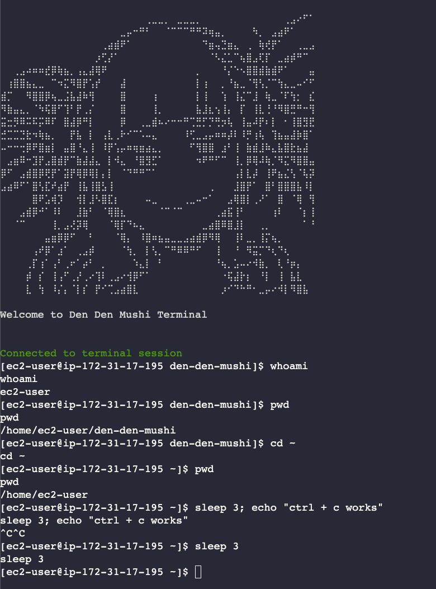

# Den Den Mushi Shell
Browser-based Terminal emulator for easy low latency shell access to cloud compute instances



## Features
- Type and Run commands
- Backspace, Ctrl+C
- Linux support
- that's it lol

## Running

1. Clone the repository
```bash
git clone https://github.com/Arabasta/den-den-mushi.git
```

2. Install dependencies
```bash
npm install
```

3. Start the server
```bash
npm start
```


## Todo
- [x] Add support for ctrl+c
- [x] Fix shell echoing back all input 
- [x] Fix able to backspace prompt
- [ ] Add key up/down support
- [x] Add support for ctrl+z, ctrl+d
- [ ] Add ctrl+r support
- [ ] Add support for ctrl+v
- [ ] Add support for ctrl+shift+c
- [ ] Add support for ctrl+shift+v
- [ ] Add vim support
- [ ] Add more themes
- [x] Add support for Windows / MacOS
